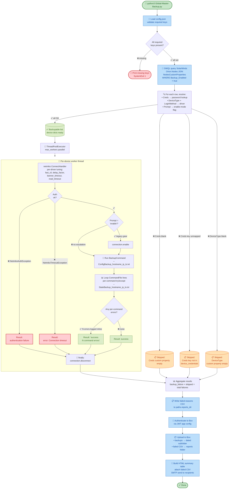

<div align="center">

# 🔌 MultiVendor Network Device Backup Automation

### 💾 *Source-of-truth driven, vendor-agnostic, production-grade backups for 1,000+ network devices*

[](https://www.python.org/)
[](https://aws.amazon.com/linux/)
[](https://github.com/ktbyers/netmiko)
[](https://www.solarwinds.com/)
[](https://www.box.com/)
[]()
[]()
[](#-license)

**🌐 Cisco IOS / IOS-XE / NX-OS / WLC** &nbsp;•&nbsp; **🔧 HPE ProCurve / Comware** &nbsp;•&nbsp; **🦒 Juniper Junos** &nbsp;•&nbsp; **📡 Aruba OS / AOS-CX** &nbsp;•&nbsp; **🔥 Palo Alto** &nbsp;•&nbsp; **🛡️ Fortinet**

</div>

---

> 🎯 **One Python script. One config file. One source of truth (SolarWinds). All vendors. All regions. No CSV inventory to babysit.**

A SolarWinds-driven, multi-vendor configuration and operational-state backup tool for ~1,000+ network devices across multiple regions, written in Python with [`netmiko`](https://github.com/ktbyers/netmiko).

---

## 📑 Table of contents

- [⚖️ Why this is different from a "traditional" backup script](#%EF%B8%8F-why-this-is-different-from-a-traditional-backup-script)
- [📸 Sample output — what a run looks like](#-sample-output--what-a-run-looks-like)
- [🏗️ Architecture](#%EF%B8%8F-architecture)
- [🔄 Automation flow (end-to-end)](#-automation-flow-end-to-end)
- [📁 Files in this repository](#-files-in-this-repository)
- [🔗 SolarWinds custom properties (the contract)](#-solarwinds-custom-properties-the-contract)
- [🚀 Quick start](#-quick-start)
- [📐 Filesystem layout & naming conventions](#-filesystem-layout--naming-conventions)
- [⚙️ Per-driver tuning](#%EF%B8%8F-per-driver-tuning)
- [📊 Operational visibility](#-operational-visibility)
- [📈 Status / scope](#-status--scope)
- [📜 License](#-license)

---

## ⚖️ Why this is different from a "traditional" backup script

Most network backup automations look like this:

> ❌ A static CSV inventory with hostnames, IPs, usernames, and passwords; one script per region (`REGION_A-backup.py`, `REGION_B-backup.py`, `REGION_C-backup.py`); a uniform `global_delay_factor=3` that's too slow for healthy gear and too fast for legacy gear; a single `try/except` that wraps the whole device run, so one bad command produces an "Unknown error" and a half-written state file.

This automation rejects every one of those defaults. The tradeoffs are deliberate:

| # | ❌ Traditional | ✅ This automation |
|---|---|---|
| 1️⃣ | **Static CSV inventory** — manual edit on every add / remove. Forgotten devices drop silently. | **Live SolarWinds query** — `WHERE cp.Backup_Enabled = true`. The network team's source of truth IS the script's source of truth. |
| 2️⃣ | **One script per region** — copy-pasted, drifts apart, fixes don't propagate. | **Single `Global-Master-Backup.py`** — no regional fork. REGION_A / REGION_B / REGION_C differences live in SolarWinds custom-property values, not in code. |
| 3️⃣ | **Blanket `global_delay_factor=3`** for every device — healthy 9300s wait the same as ProCurve 2920s. | **Per-driver tuning dict** — `cisco_ios_ssh` runs at `delay=2, fast_cli=False, read_timeout=120`; `hp_procurve_telnet` gets `delay=4, banner_timeout=45`. Healthy gear is fast; slow gear gets the headroom it needs. |
| 4️⃣ | **Single try/except wraps the whole device** — one failed `show` = abort + half-written state file. | **Per-command try/except inside the loop** — log the error in the output file, continue with the next command. Result becomes `success (N command errors)` instead of a hard fail. |
| 5️⃣ | `"error: Unknown error"` for every non-auth failure (a real bug from `failure_reasons.get(type(e), 'Unknown error')` — exceptions are subclasses, the dict's `Exception` key never matches). | **Real exception class names** in the failed-reasons CSV — `error: exceptions.ReadTimeout: Pattern not detected: '#$' in output` or `error: ssh_exception.SSHException: Error reading SSH protocol banner`. |
| 6️⃣ | **Passwords in CSV alongside hostnames.** Anyone with read access has all credentials. | **Credential routing via custom property.** SolarWinds `Creds` field names a key (e.g. `admin_REGION_A`); `config.json` resolves the key to a password. Passwords live in one place; rotation = one config edit. |
| 7️⃣ | **Hardcoded fallback defaults** — forget to deploy `config.json`, the script silently uses dev SMTP, dev folder IDs, dev recipients. | **No defaults in the loader.** Required keys missing → script exits at startup with an explicit list of what's missing. Config is mandatory, not optional. |
| 8️⃣ | **Skipped devices are invisible** — bad creds, missing custom properties, or unmapped credential keys silently drop devices from the run. | **Skipped devices land in the failed-reasons CSV** with the exact reason (`skipped: Creds key "X" not found in device_credentials`). |
| 9️⃣ | **Email reports total count = devices the script processed.** Drops are invisible. | **Email reports total count = devices SolarWinds said were `Backup_Enabled`.** Skipped devices count as failures so percentages reflect reality. The body breaks "failed during backup" vs "skipped due to data" so triage knows where to look. |
| 🔟 | **No pre-flight check.** First sign of a config problem is a 491-device run that produces 491 failures. | **`check-solarwinds-device.py`** — one-device pre-flight that lists every custom property currently on a node, flags any of the nine backup-required properties as `[PRESENT]` or `[NOT YET CREATED]`, and tells you whether the device will be backed up or skipped. |
| 1️⃣1️⃣ | **Per-region Box folders, hard-coded paths, regional output structures.** | **One Box destination, dated subfolder structure.** Handed to ops as a single tree they can search with one Box query. |
| 1️⃣2️⃣ | **No connection cleanup on exception** — TCP `CLOSE_WAIT` accumulates over a long run, eventually exhausts FDs. | **`connection.disconnect()` in a `finally` block** for every device. |

> 💡 The pattern across all twelve: **fail loudly when the data is wrong, fail with a triagable error when the network is wrong, and don't punish healthy devices for the existence of sick ones**.

---

## 📸 Sample output — what a run looks like

Three artifacts come out of every run. Below is a sanitized preview of two of them so you can see the shape without cloning the repo.

### 🖥️ Per-device stdout log (run progress)

```text
Fetching inventory from SolarWinds...
Loaded 1008 devices with Backup_Enabled=true. 1005 backupable, 3 skipped (custom-property issues).
  SKIP: EXAMPLE-CORE-SW03 (203.0.113.10) - skipped: DeviceType custom property empty
  SKIP: EXAMPLE-DIST-SW04 (192.0.2.20)   - skipped: Creds custom property empty
  SKIP: EXAMPLE-IDF3-SW02 (198.51.100.30) - skipped: Creds key "admin_legacy_site_x" not found in device_credentials (config.json)
Backing up devices: 100%|████████████████████████| 1005/1005 [12:23<00:00,  1.35device/s]
  [OK  ] EXAMPLE-CORE-SW01                    192.0.2.10       cisco_ios_ssh             4.8s
  [OK  ] EXAMPLE-DIST-SW02                    192.0.2.11       cisco_ios_ssh             5.1s
  [FAIL] EXAMPLE-IDF1-SW01                    198.51.100.21    cisco_ios_telnet          60.2s
  [OK  ] EXAMPLE-IDF2-SW01                    198.51.100.22    hp_procurve_ssh           7.4s
  [FAIL] EXAMPLE-LAB-WLC01                    203.0.113.40     cisco_wlc_ssh             182.7s
  ...
Email sent successfully!
```

### 📧 The HTML summary email

> **Subject:** `Network Backup Summary at 02/05 on 02/05/2026`

<table>
<tr><td>

Dear Team,

Here is the summary of the device backup process. Percentages are calculated against the number of devices marked `Backup_Enabled = true` in SolarWinds.

#### Backup Summary Report

<table border="1" cellpadding="6" cellspacing="0">
<tr>
  <th>Backup-Enabled<br>in SolarWinds</th>
  <th>Successful<br>Backups</th>
  <th>Failed<br>(total)</th>
  <th>Failed during<br>backup</th>
  <th>Skipped<br>(custom-property issues)</th>
  <th>Success %</th>
  <th>Failure %</th>
  <th>Total Time<br>(sec)</th>
</tr>
<tr align="center">
  <td>1008</td>
  <td>994</td>
  <td>14</td>
  <td>11</td>
  <td>3</td>
  <td>98.61%</td>
  <td>1.39%</td>
  <td>743.27</td>
</tr>
</table>

**Failed during backup** = device was attempted but the connection, authentication, or command run failed.
**Skipped** = device had `Backup_Enabled = true` in SolarWinds but a required custom property (`Creds`, `DeviceType`, or a credential key absent from `config.json`) prevented the script from attempting it.

The attached CSV lists every non-successful device with its specific reason in the `Result` column.

Best regards,
Backup Automation System

</td></tr>
</table>

> 📨 Raw HTML source: [`examples/example-email-body.html`](examples/example-email-body.html) — open in a browser to see the unstyled email exactly as recipients receive it.

### 📋 The failed-reasons CSV (attached to the email and uploaded to Box)

Every device that did **not** finish with `success` lands here. Showing 8 representative rows from the 14 in the [full sample file](examples/example-failed-reasons.csv):

| LocationName | Hostname | IP | Vendor | DeviceType | LoginMethod | Result |
|---|---|---|---|---|---|---|
| Example Datacenter, Region A | EXAMPLE-CORE-SW01 | 192.0.2.10 | Cisco | cisco_ios_ssh | ssh | `error: Connection timeout` |
| Example Datacenter, Region A | EXAMPLE-DIST-SW02 | 192.0.2.11 | Cisco | cisco_ios_ssh | ssh | `authentication failure` |
| Example Branch Office, Region B | EXAMPLE-IDF1-SW01 | 198.51.100.21 | Cisco | cisco_ios_telnet | telnet | `error: ssh_exception.SSHException: Error reading SSH protocol banner` |
| Example Branch Office, Region B | EXAMPLE-IDF2-SW01 | 198.51.100.22 | HPE | hp_procurve_ssh | ssh | `error: exceptions.ReadTimeout: Pattern not detected: '#$' in output` |
| Example Site G, Region A | EXAMPLE-EDGE-SW01 | 192.0.2.30 | Cisco | cisco_ios_ssh | ssh | `error: socket.gaierror: [Errno -2] Name or service not known` |
| Example Branch Office, Region C | EXAMPLE-CORE-SW03 | 203.0.113.10 | Cisco | *(blank)* | *(blank)* | `skipped: DeviceType custom property empty` |
| Example Site E, Region A | EXAMPLE-DIST-SW04 | 192.0.2.20 | Cisco | cisco_ios | ssh | `skipped: Creds custom property empty` |
| Example Site F, Region B | EXAMPLE-IDF3-SW02 | 198.51.100.30 | Cisco | cisco_ios | ssh | `skipped: Creds key "admin_legacy_site_x" not found in device_credentials (config.json)` |

> 🔑 **Reading the `Result` column at a glance**
> - `success` (any prefix) → device completed; not in this CSV
> - `success (N command errors)` → connected and ran commands but N had per-command errors logged inline in the state-backup file
> - `authentication failure` → TCP connected, credentials rejected
> - `error: ...` → connection or command-run failure with the real exception class name (no more `Unknown error`)
> - `skipped: ...` → device never attempted; SolarWinds custom-property data is missing or unmapped
>
> 📚 Full triage cheat sheet for every error / skip variant: [`examples/README.md`](examples/README.md#what-youll-see-in-result)

---

## 🏗️ Architecture

```
              +---------------------------+
              |  🔍 SolarWinds (SoT)      |
              |   - Orion.Nodes           |
              |   - Custom Properties:    |
              |       Backup_Enabled,     |
              |       DeviceType,         |
              |       LoginMethod,        |
              |       Creds, ...          |
              +-------------+-------------+
                            | 📡 one SWQL query (orionsdk)
                            v
              +---------------------------+
              |  🐍 Global-Master-Backup  |
              |   - resolve_netmiko_driver|
              |   - tuning_for(driver)    |
              |   - format_error(exc)     |
              +-------------+-------------+
                            | 🧵 ThreadPoolExecutor
              +-------------v-------------+
              |   🔌 Per-device worker    |
              |    netmiko ConnectHandler |
              |    config + state backup  |
              |    per-command try/except |
              +------+-----------+--------+
                     |           |
              +------v---+   +---v------+
              | 📊 State |   | ⚙️ Config|
              |  files   |   |  files   |
              +------+---+   +---+------+
                     |           |
                     v           v
              +---------------------------+
              | 📦 Box (single folder)    |
              | 📋 Failed-reasons CSV     |
              | 📧 HTML email summary     |
              +---------------------------+
```

---

## 🔄 Automation flow (end-to-end)

What `Global-Master-Backup.py` actually does, top to bottom — config validation, SolarWinds query, per-device filtering, parallel backup, aggregation, Box upload, email.



> 🎯 **Three failure surfaces, each with a distinct fingerprint:**
> - 🟧 **Skipped** (data problem) → fix in SolarWinds or `config.json`
> - 🟥 **Error / auth fail** (network or device problem) → triage with the real exception class name in the CSV
> - 🟩 **Success (N command errors)** (transient command issue) → device backed up; per-command errors logged inline in the state file

---

## 📁 Files in this repository

| 📄 File | 🎯 Purpose |
|---|---|
| 🐍 [`Global-Master-Backup.py`](Global-Master-Backup.py) | The backup orchestrator. Single global script for all vendors and regions. |
| 🔍 [`check-solarwinds-device.py`](check-solarwinds-device.py) | Pre-flight diagnostic. Pull a single device's standard fields and *all* defined custom properties, with a verdict on whether the script will back it up. |
| ⚙️ [`config.example.json`](config.example.json) | Configuration schema. Copy to `config.json` and fill in the placeholders. |
| 📋 [`inventory.example.csv`](inventory.example.csv) | Five-row example showing the column schema your old static-CSV inventory probably has, useful for migrating to SolarWinds custom properties. |
| 📦 [`requirements.txt`](requirements.txt) | Python dependencies. |
| 📘 [`PROJECT-NOTES.md`](PROJECT-NOTES.md) | Full design reference: architecture, custom-property table, deployment steps, design decisions, open items. |
| 🔗 [`SolarWinds-Custom-Properties-Reference.md`](SolarWinds-Custom-Properties-Reference.md) | Hand-off doc for the SolarWinds team — the nine properties, their types, sample devices, validation checklist. |
| 🐛 [`KNOWN-ISSUES.md`](KNOWN-ISSUES.md) | A running log of bugs we've hit, root causes, fixes, and prevention guidance. |
| 📨 [`examples/`](examples/) | Sample artifacts a real run produces — failed-reasons CSV, email body HTML, with annotations explaining each `Result` value. |

---

## 🔗 SolarWinds custom properties (the contract)

The script reads these nine properties from `Orion.NodesCustomProperties` for each node where `Backup_Enabled = true`:

| 🏷️ Property | 🔤 Type | 🎯 Purpose |
|---|---|---|
| ✅ `Backup_Enabled` | Boolean *or* Text | Master filter. Script accepts both `True`/`False` and `Yes`/`No`. |
| 📝 `Disable_Reason` | Text | Free-text note when `Backup_Enabled = false`. Informational only. |
| 🏭 `DeviceType` | Text | Vendor / OS base — `cisco_ios`, `hp_procurve`, `juniper_junos`, etc. |
| 🔐 `LoginMethod` | Text | `ssh` or `telnet`. Combined with `DeviceType` → netmiko driver. |
| 💾 `BackupCommand` | Text | One-shot config dump command (e.g. `show running-config`). |
| 📜 `CommandFile` | Text | Filename of the multi-command state-backup list. |
| 🔑 `Creds` | Text | Credential key (resolves to a password in `config.json`). |
| ⬆️ `Prompt` | Text | `enable` if device requires enable-mode escalation. |
| 🔓 `EnableCred` | Text | Enable-mode secret. Required when `Prompt = enable`. |

> ℹ️ Names cannot contain spaces (SolarWinds platform constraint). Full reference + sample devices in [`SolarWinds-Custom-Properties-Reference.md`](SolarWinds-Custom-Properties-Reference.md).

---

## 🚀 Quick start

```bash
# 1️⃣ Clone and enter
git clone https://github.com/tinkughosh/MultiVendor-Network-Device-Backup-Automation.git
cd MultiVendor-Network-Device-Backup-Automation

# 2️⃣ Install dependencies (Python 3.9+)
pip install -r requirements.txt

# 3️⃣ Copy the config template and fill in real values
cp config.example.json config.json
chmod 600 config.json
$EDITOR config.json

# 4️⃣ Drop the per-vendor command-list files into the path
#    you set in config.json -> paths.command_file_path
#    (e.g. Cisco-State-Backup-Commands.txt with one show-command per line)

# 5️⃣ Drop your Box JWT app config at paths.jwt_config_path

# 6️⃣ Pre-flight check against one device first
python3 check-solarwinds-device.py
# (enter SolarWinds creds + a known device IP; verify all 9 properties are PRESENT)

# 7️⃣ Run the full backup
python3 Global-Master-Backup.py
```

---

## 📐 Filesystem layout & naming conventions

> 🐧 The reference deployment is a **Linux host** — typically an **AWS EC2** instance (Amazon Linux 2023 or Ubuntu). Nothing in the script is EC2-specific; any Linux box with outbound TCP to your devices, SolarWinds, Box, and SMTP works. Windows is not tested.

### 🌲 Recommended directory tree

```
<APP_INSTALL_ROOT>/                       # 📍 e.g. /opt/network-backup, /srv/network-backup, /home/<svc-user>/network-backup
├── 🐍 Global-Master-Backup.py            # the script
├── 🔍 check-solarwinds-device.py         # pre-flight diagnostic
├── 🔐 config.json                        # chmod 600 — never world-readable
├── 📦 requirements.txt
├── 🐍 venv/                              # python -m venv venv
├── 📥 inputs/                            # paths.command_file_path
│   ├── 🔑 box_jwt.json                   # paths.jwt_config_path  (chmod 600)
│   ├── 📜 Cisco-State-Backup-Commands.txt
│   ├── 📜 Hpe-State-Backup-Commands.txt
│   ├── 📜 WLC-State-Backup-Commands.txt
│   └── 📜 Juniper-State-Backup-Commands.txt
├── 📤 outputs/                           # paths.backup_output_dir's parent (or this itself)
│   └── 📁 NetworkBackups/
│       └── 📅 <DD-MM-YYYY>/              # auto-created dated subfolder
│           ├── 📊 StateBackup_<YYYY-MM-DD_HH-MM-SS>/
│           │   ├── StateBackup_<hostname>_<ip>_<timestamp>.txt
│           │   └── ...
│           └── 💾 ConfigBackup_<YYYY-MM-DD_HH-MM-SS>/
│               ├── ConfigBackup_<hostname>_<ip>_<timestamp>.txt
│               └── ...
└── 📋 reports/                           # paths.reports_dir
    └── Global-backup-failed-reasons-<YYYY-MM-DD_HH-MM-SS>.csv
```

`<APP_INSTALL_ROOT>` is whatever you choose — the example `config.example.json` ships with `/opt/network-backup` as a placeholder. Pick a path your service account owns and that survives instance refreshes (an EBS volume mount, not the ephemeral root if you re-image often).

### 📛 Output filename conventions

The script controls these — they are not configurable, only documented for reference:

| 📦 Artifact | 🏷️ Filename pattern | 📍 Where |
|---|---|---|
| 📊 State backup (per device) | `StateBackup_<hostname>_<ip>_<YYYY-MM-DD_HH-MM-SS>.txt` | `<backup_output_dir>/<DD-MM-YYYY>/StateBackup_<timestamp>/` |
| 💾 Config backup (per device) | `ConfigBackup_<hostname>_<ip>_<YYYY-MM-DD_HH-MM-SS>.txt` | `<backup_output_dir>/<DD-MM-YYYY>/ConfigBackup_<timestamp>/` |
| 📋 Failed-reasons report | `Global-backup-failed-reasons-<YYYY-MM-DD_HH-MM-SS>.csv` | `<reports_dir>/` |
| ☁️ Box: backups | `<DD-MM-YYYY>/StateBackup_<timestamp>/`, `<DD-MM-YYYY>/ConfigBackup_<timestamp>/` | under `box.folder_id` |
| ☁️ Box: failed reports | `Global-Failed-Backups-Reports/Global-backup-failed-reasons-*.csv` | under `box.failed_csv_folder_id` |

`<hostname>` is whatever `connection.find_prompt()` returns after stripping `#`, `>`, and whitespace. `<timestamp>` is `strftime('%Y-%m-%d_%H-%M-%S')` captured once at the start of a run, so all files in a single run share the same timestamp.

### 🛡️ Permissions & service account

- 👤 Run the script under a dedicated, non-login service account (e.g. `svc-network-backup`).
- 🔐 `config.json` and `inputs/box_jwt.json` should be `chmod 600` and owned by that service account — they contain SolarWinds creds, device passwords, and Box JWT private key.
- 📁 `outputs/` and `reports/` should be writable by the service account; world-readable is fine if the host is not multi-tenant, but `0750` (group: ops team) is safer.

### ⏰ Schedule

`cron` on the Linux host is the typical scheduler. Example crontab entry:

```cron
# 🌙 Nightly backup at 02:00 UTC
0 2 * * * cd /opt/network-backup && /opt/network-backup/venv/bin/python /opt/network-backup/Global-Master-Backup.py >> /var/log/network-backup.log 2>&1
```

systemd timers work equally well if your distro/policy prefers them.

---

## ⚙️ Per-driver tuning

Each netmiko driver string keys into `NETMIKO_TUNING` in `Global-Master-Backup.py`. A driver not in the table falls back to a sensible default.

```python
NETMIKO_TUNING = {
    'cisco_ios_ssh':        {'connect_kwargs': {'fast_cli': False, 'global_delay_factor': 2, 'banner_timeout': 20}, 'read_timeout': 120},
    'cisco_ios_telnet':     {'connect_kwargs': {'fast_cli': False, 'global_delay_factor': 3, 'banner_timeout': 30}, 'read_timeout': 120},
    'cisco_wlc_ssh':        {'connect_kwargs': {'fast_cli': False, 'global_delay_factor': 3, 'banner_timeout': 30}, 'read_timeout': 180},
    'aruba_os_ssh':         {'connect_kwargs': {'fast_cli': False, 'global_delay_factor': 3, 'banner_timeout': 30}, 'read_timeout': 180},
    'hp_procurve_ssh':      {'connect_kwargs': {'fast_cli': False, 'global_delay_factor': 3, 'banner_timeout': 30}, 'read_timeout': 120},
    'hp_procurve_telnet':   {'connect_kwargs': {'fast_cli': False, 'global_delay_factor': 4, 'banner_timeout': 45}, 'read_timeout': 120},
    'juniper_junos_ssh':    {'connect_kwargs': {'fast_cli': False, 'global_delay_factor': 2, 'banner_timeout': 20}, 'read_timeout': 120},
    'juniper_junos_telnet': {'connect_kwargs': {'fast_cli': False, 'global_delay_factor': 3, 'banner_timeout': 30}, 'read_timeout': 120},
}
```

> ➕ Adding a new vendor = adding one row.

---

## 📊 Operational visibility

After a run, three artifacts land:

1. 🖥️ **Per-device timing log on stdout** — `[OK ] hostname  ip  driver  N.Ns` or `[FAIL] ...`. Spot a vendor whose tuning is wrong on a single run.
2. 📋 **Failed-reasons CSV** — every non-success device with the real exception class name in the `Result` column. Skipped devices appear here too with their skip reason. &nbsp;➜&nbsp; see [`examples/example-failed-reasons.csv`](examples/example-failed-reasons.csv) for a sanitized sample, plus a [Result-value cheat sheet](examples/README.md#-example-failed-reasonscsv) explaining every error string.
3. 📧 **HTML email summary** — total / success / failed (broken into "failed during backup" vs "skipped due to data") / success% / failure%. Subject line includes the run timestamp. &nbsp;➜&nbsp; see [`examples/example-email-body.html`](examples/example-email-body.html) (open in a browser to preview the rendered email).

> 🎯 Percentages are calculated against the count SolarWinds returned, not against the count the script *attempted* — drops are visible.

---

## 📈 Status / scope

- 🌍 **Production scale** — ~1,000+ devices across three regions
- 🏭 **Vendors covered** — Cisco IOS / IOS-XE / NX-OS / WLC, HPE ProCurve, Juniper Junos, Aruba OS
- ⏰ **Schedule** — nightly via cron on a single EC2 host
- ☁️ **Storage** — Box (per-region or unified — your call via `config.json`)
- 📧 **Notifications** — SMTP relay

> 🐛 See [`KNOWN-ISSUES.md`](KNOWN-ISSUES.md) for the running log of bugs hit, root causes, and fixes — useful both as a real-world history and as a lessons-learned document for anyone building a similar tool.

---

## 📜 License

Released for reference and educational use. No warranty — use at your own risk in your own environment.

---

<div align="center">

### 🛠️ Built with

[](https://www.python.org/)
[](https://github.com/ktbyers/netmiko)
[](https://www.solarwinds.com/)
[](https://www.box.com/)
[](https://aws.amazon.com/ec2/)

⭐ **If this helped you, drop a star — it helps others find it too.**

</div>
